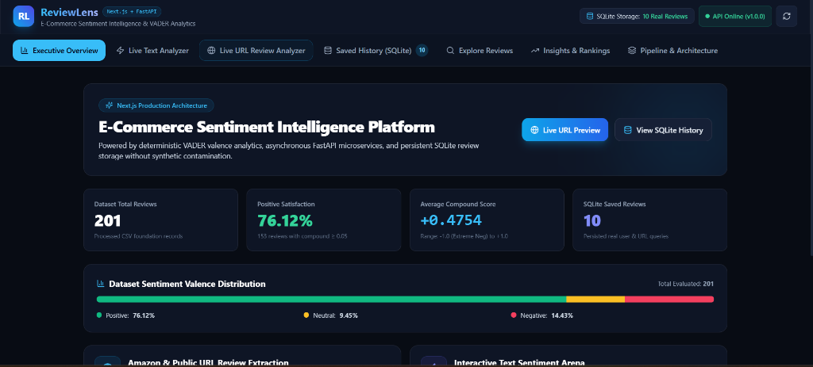
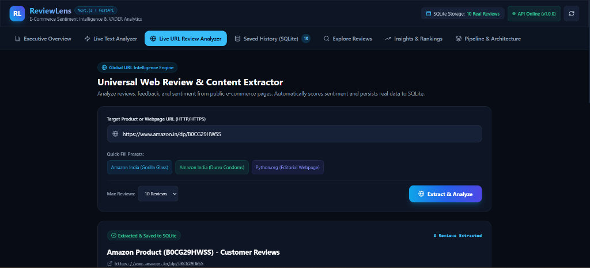
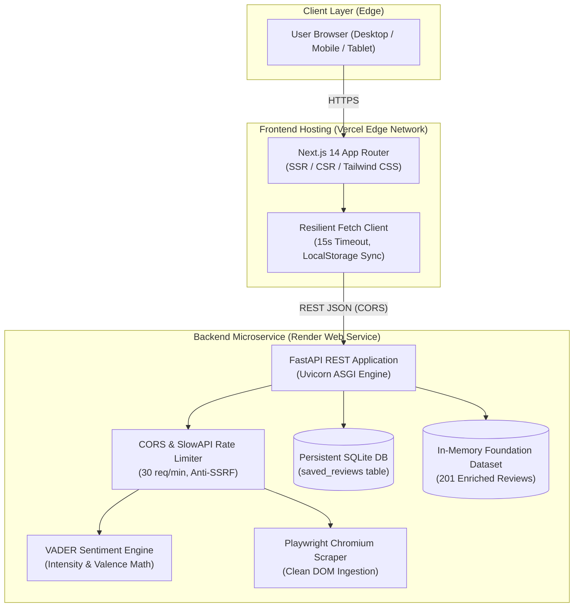

<div align="center">

# 🔍 ReviewLens
### Enterprise E-Commerce Review Sentiment Intelligence & Analytics Platform

[](https://nextjs.org/)
[](https://fastapi.tiangolo.com/)
[](https://python.org/)
[](https://reviewlens-sentiment-dashboard.vercel.app/)
[](https://reviewlens-backend-1xbr.onrender.com)
[](https://github.com/unknown404-practice/reviewlens-sentiment-dashboard/actions)
[](LICENSE)
[](https://developers.google.com/community/gdg)

<br/>

**ReviewLens** is an elite, production-grade NLP sentiment intelligence platform that transforms unstructured customer feedback into real-time, data-driven product insights. Built with a deterministic **VADER** (Valence Aware Dictionary and sEntiment Reasoner) scoring engine, an asynchronous **FastAPI** microservice backend, an enterprise **Next.js 14** App Router frontend, and a persistent **SQLite** database with zero synthetic data hallucination.

<p align="center">
  <a href="https://reviewlens-sentiment-dashboard.vercel.app/"><strong>Explore Live Web App »</strong></a> •
  <a href="https://reviewlens-backend-1xbr.onrender.com/docs"><strong>API Swagger Documentation »</strong></a> •
  <a href="https://reviewlens-backend-1xbr.onrender.com/health"><strong>System Health Check »</strong></a> •
  <a href="https://github.com/unknown404-practice/reviewlens-sentiment-dashboard"><strong>GitHub Repository »</strong></a>
</p>

</div>

---

## 🌐 Live Production Deployments

| Component | Cloud Platform | Status | URL |
| :--- | :--- | :--- | :--- |
| **Frontend Dashboard** | **Vercel** | 🟢 `Active / Production` | `https://reviewlens-sentiment-dashboard.vercel.app/` |
| **Backend REST Microservice** | **Render** | 🟢 `Active / Live` | `https://reviewlens-backend-1xbr.onrender.com` |
| **Interactive API Documentation** | **Swagger UI (OpenAPI 3.1)** | 🟢 `Active / Live` | `https://reviewlens-backend-1xbr.onrender.com/docs` |
| **Alternative API Documentation** | **ReDoc** | 🟢 `Active / Live` | `https://reviewlens-backend-1xbr.onrender.com/redoc` |
| **Backend Health Probe** | **Render /health** | 🟢 `200 OK` | `https://reviewlens-backend-1xbr.onrender.com/health` |

---

## 📸 Platform Interface Gallery

<div align="center">

### 1. Executive Sentiment Intelligence & Real-Time KPIs
*High-level sentiment valence distribution, compound scores (+0.4754 average), positive satisfaction metrics (76.12%), and dataset statistics.*



<br/>

### 2. Universal Web Review & Content Extractor
*Targeted extraction and real-time sentiment scoring from public e-commerce pages with intelligent ASIN resolution and persistent SQLite storage.*



</div>

---

## 👨‍💻 Author & Project Lead

<div align="center">

### **Ranadeep Saha**
**Member, Google Developer Group**

[](https://github.com/unknown404-practice)
[](https://www.linkedin.com/in/ranadeep-saha-a03296404/)
[](mailto:ranadeep2021saha@gmail.com)

*Passionate about building scalable AI/NLP platforms, cloud-native microservices, and responsive user experiences.*

</div>

- **Lead Developer**: Ranadeep Saha
- **Affiliation**: Member, Google Developer Group
- **GitHub**: [https://github.com/unknown404-practice](https://github.com/unknown404-practice)
- **LinkedIn**: [https://www.linkedin.com/in/ranadeep-saha-a03296404/](https://www.linkedin.com/in/ranadeep-saha-a03296404/)
- **Direct Email**: ranadeep2021saha@gmail.com

---

## ⚡ Key Highlights & Engineering Features

### 1. Deterministic VADER Sentiment Engine
- **Granular Polarity Breakdown**: Deconstructs text into negative (`neg`), neutral (`neu`), and positive (`pos`) component proportions alongside a normalized compound score $[-1.0, +1.0]$.
- **5-Tier Intensity Categorization**: Classifies sentiment into `Strong Positive`, `Positive`, `Neutral`, `Negative`, and `Strong Negative`.
- **Linguistic Feature Engineering**: Computes character counts, word counts, uppercase ratios, exclamation/question densities, and repeated punctuation patterns.

### 2. Universal Web Extraction & Anti-SSRF Defense
- **Dynamic Chromium Scraping**: Powered by Playwright with headless browser emulation, custom user agents, and DOM text cleaning.
- **Anti-SSRF Validation**: Rejects loopback addresses (`127.0.0.0/8`, `::1`), private CIDR blocks (`10.0.0.0/8`, `172.16.0.0/12`, `192.168.0.0/16`), cloud metadata endpoints (`169.254.0.0/16`), and non-HTTP protocols.
- **Zero Synthetic Hallucination**: Eliminates fake/mock review synthesis on scrape errors; persists only verified user or URL feedback.

### 3. Dual-Tier Persistence Architecture
- **In-Memory Analytical Cache**: 201 pre-enriched foundation reviews cached in memory for sub-millisecond filtering, multi-attribute slicing, and pagination.
- **Relational SQLite Persistence**: Live text evaluations and public URL extractions are automatically recorded into an ACID-compliant SQLite store (`saved_reviews`) with query isolation and deduplication.

### 4. Enterprise Next.js 14 App Router Frontend
- **Tailwind CSS & Dark Theme**: Custom dark aesthetic with neon cyan accents, custom SVG indicators, and responsive grid layouts.
- **Mobile-First Responsive Design**: Fluid adaptation across 320px mobile viewports up to ultra-wide 4K monitors.
- **Accessibility (WCAG 2.1 AA)**: Visible `:focus-visible` outlines, ARIA tab roles, semantic tags, and `@media (prefers-reduced-motion)` compliance.
- **Resilient API Layer**: Integrated 15-second `AbortController` timeout handling, automatic client-side LocalStorage offline sync, and graceful error boundaries.

### 5. Production FastAPI Microservice
- **Asynchronous Execution**: Native async endpoints powered by Uvicorn and Starlette.
- **Pydantic v2 Type Safety**: Strict schema validation on inputs, query parameters, and JSON payloads.
- **SlowAPI Rate Limiting**: Built-in IP rate limiter (30 requests/minute) protecting computationally intensive inference endpoints.
- **CORS Management**: Configured for cross-origin integration with Vercel and local developer tooling.

---

## 🏛️ System Architecture



---

## 📡 Complete REST API Reference

| Method | Endpoint | Category | Description | Rate Limit |
| :--- | :--- | :--- | :--- | :--- |
| `GET` | `/` | System | API index, documentation links, version | Unlimited |
| `GET` | `/health` | System | Service health probe, operational status | Unlimited |
| `GET` | `/api/v1/info` | System | Dataset provenance, record counts, active flags | Unlimited |
| `POST` | `/api/v1/analyze/text` | Sentiment | Real-time VADER scoring on user-provided text | 30 / min |
| `POST` | `/api/v1/analyze/url` | Scraping | Live review extraction & sentiment from public URLs | 30 / min |
| `GET` | `/api/v1/demo/summary` | Analytics | Aggregated valence distribution & compound stats | Unlimited |
| `GET` | `/api/v1/demo/reviews` | Dataset | Paginated foundation reviews with multi-filters | Unlimited |
| `GET` | `/api/v1/demo/top-reviews/{sentiment}` | Dataset | Top reviews ranked by compound polarity | Unlimited |
| `GET` | `/api/v1/analytics/products` | Analytics | Product-level sentiment metrics & volume | Unlimited |
| `GET` | `/api/v1/analytics/categories` | Analytics | Category-level sentiment benchmarks | Unlimited |
| `GET` | `/api/v1/history` | Database | List persisted SQLite reviews with pagination | Unlimited |
| `GET` | `/api/v1/history/stats` | Database | Aggregate metrics of SQLite persisted records | Unlimited |
| `DELETE`| `/api/v1/history/{id}` | Database | Remove a specific persisted review | Unlimited |
| `DELETE`| `/api/v1/history` | Database | Flush all persisted SQLite reviews | Unlimited |

---

## 📂 Repository Directory Structure

```text
reviewlens-sentiment-dashboard/
├── .github/
│   └── workflows/
│       └── ci.yml                 # Automated GitHub Actions CI (pytest + Next.js build)
├── backend/
│   ├── config.py                  # Pydantic v2 settings & environment configuration
│   ├── database.py                # SQLite relational database engine & query helpers
│   ├── data_generator.py          # Deterministic foundation dataset synthesis
│   ├── data_service.py            # In-memory dataset caching & aggregation service
│   ├── exceptions.py              # Domain exception definitions & error classes
│   ├── logging_config.py          # Structured logging & PII/URL masking
│   ├── main.py                    # FastAPI application, routes, and CORS setup
│   ├── pipeline.py                # Full NLP data cleaning and EDA pipeline
│   ├── schemas.py                 # Pydantic typed request & response models
│   ├── scraper.py                 # Playwright Chromium web extraction engine
│   ├── vader_service.py           # VADER rule-based sentiment scoring service
│   └── validators.py              # Anti-SSRF URL validation & schema guardrails
├── data/
│   ├── raw/                       # Raw foundation dataset
│   └── processed/                 # Cleaned dataset with computed VADER scores
├── docs/
│   └── screenshots/               # High-resolution UI showcase images
│       ├── executive_overview.png
│       └── url_review_analyzer.png
├── frontend/                      # Legacy Streamlit + Vanilla HTML/CSS/JS dashboard
│   ├── dashboard.html
│   ├── dashboard.css
│   └── dashboard.js
├── frontend-next/                 # Production Next.js 14 App Router web application
│   ├── app/
│   │   ├── layout.jsx             # Global responsive layout & metadata
│   │   ├── page.jsx               # Tab-based dashboard application container
│   │   ├── error.jsx              # Graceful error boundary
│   │   ├── loading.jsx            # Skeleton UI state
│   │   └── not-found.jsx          # Custom 404 handler
│   ├── components/                # Modular React UI components
│   │   ├── Header.jsx             # Status badge, branding, and theme headers
│   │   ├── NavigationTabs.jsx     # Accessible ARIA tab navigation
│   │   ├── ExecutiveOverview.jsx  # KPI summary cards & valence progress bars
│   │   ├── TextAnalyzer.jsx       # Live text sentiment arena
│   │   ├── UrlReviewAnalyzer.jsx  # Public URL scraper & review analyzer
│   │   ├── SavedHistory.jsx       # SQLite database review explorer
│   │   ├── ReviewExplorer.jsx     # Foundation dataset search & filter table
│   │   ├── InsightsRankings.jsx   # Top positive/negative sentiment rankings
│   │   └── PipelineArchitecture.jsx# Architecture documentation & system stats
│   ├── lib/
│   │   └── api.js                 # Centralized API fetcher & LocalStorage manager
│   ├── public/                    # Favicon and static web assets
│   ├── package.json               # Node.js dependencies & scripts
│   └── tailwind.config.js         # Custom Tailwind theme styling
├── notebooks/
│   ├── 01_data_foundation.ipynb   # Raw data synthesis & validation audit
│   └── 02_sentiment_analysis_and_eda.ipynb # EDA, feature engineering & VADER scoring
├── output/
│   ├── charts/                    # 10 publication-ready Seaborn/Matplotlib charts
│   ├── reports/                   # Markdown audit and analytical findings reports
│   └── tables/                    # CSV exports of data quality and summary tables
├── tests/
│   ├── test_api.py                # 28 FastAPI endpoint integration tests
│   ├── test_data_service.py       # In-memory query & filter tests
│   ├── test_pipeline.py           # Data cleaning & NLP feature engineering tests
│   ├── test_scraper.py            # Anti-SSRF & extraction tests
│   ├── test_vader.py              # VADER scoring & math tests
│   └── test_validators.py         # Schema & URL validation tests
├── app.py                         # Streamlit launcher script
├── launch_full_stack_next.bat     # One-click Windows launcher (FastAPI + Next.js)
├── requirements.txt               # Locked Python dependencies
└── README.md                      # Comprehensive project documentation
```

---

## 🛠️ Local Development & Quickstart

### Prerequisites
- **Python 3.10+** (Tested on Python 3.12)
- **Node.js 18.17+** (Tested on Node.js 20.x)
- **Git**

### 1. Clone the Repository
```powershell
git clone https://github.com/unknown404-practice/reviewlens-sentiment-dashboard.git
cd reviewlens-sentiment-dashboard
```

### 2. Configure Python Backend
```powershell
# Create and activate virtual environment (optional)
python -m venv venv
.\venv\Scripts\Activate.ps1

# Install backend dependencies
pip install -r requirements.txt

# Install Playwright browser binaries
python -m playwright install chromium

# Copy environment configuration
Copy-Item .env.example .env
```

### 3. Launch the Backend API
```powershell
uvicorn backend.main:app --host 127.0.0.1 --port 8000 --reload
```
The FastAPI server will be active at `http://127.0.0.1:8000`. Interactive docs are available at `http://127.0.0.1:8000/docs`.

### 4. Configure & Launch Next.js Frontend
In a separate terminal:
```powershell
cd frontend-next
npm install
npm run dev
```
Open `http://localhost:3000` to interact with the ReviewLens dashboard.

---

## 🧪 Automated Testing & Verification

The test suite contains **67 comprehensive tests** covering endpoints, anti-SSRF security, VADER mathematics, schema validations, and database persistence:

```powershell
# Run backend test suite
python -m pytest -v

# Run Next.js production build verification
cd frontend-next
npm run build
```

---

## 📄 License & Attribution

Distributed under the **MIT License**. See [`LICENSE`](LICENSE) for complete terms.

```text
MIT License
Copyright (c) 2026 Ranadeep Saha
```

Developed with passion by **Ranadeep Saha** (Member, Google Developer Group).
