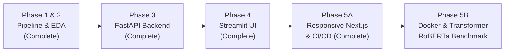

# ReviewLens: E-Commerce Review Sentiment Intelligence Dashboard

ReviewLens is a portfolio-ready, production-architected NLP sentiment intelligence platform that ingests customer product reviews, performs automated schema validation and text sanitization, extracts granular linguistic and temporal features, executes rule-based sentiment analytics using VADER (Valence Aware Dictionary and sEntiment Reasoner), and exposes typed REST endpoints through a high-performance FastAPI service. Designed to scale from exploratory data science into a containerized microservice and executive dashboard, ReviewLens transforms unstructured consumer feedback into prioritized, data-driven product insights and category-level competitive intelligence.

---

## Current Scope (Phases 1, 2, 3 & 4 Completed)

- **Phase 1: Project Foundation & Raw Dataset Pipeline (`notebooks/01_data_foundation.ipynb`)**
  - Production dataset schema specification with 13 core review attributes.
  - Reusable, typed validation and sanitization library in `backend/validators.py`.
  - Deterministic synthetic demonstration dataset generator (`backend/data_generator.py`, seed=42) supporting 5 categories and 15 products with intentional data quality anomalies.
  - Automated data quality audit reporting (`output/tables/raw_data_quality_report.csv` and `output/reports/raw_dataset_profile.md`).

- **Phase 2: Data Cleaning, Feature Engineering & VADER Sentiment Analysis (`notebooks/02_sentiment_analysis_and_eda.ipynb`)**
  - Full sanitization pipeline: whitespace collapsing, HTML tag stripping, URL tokenization (`[URL]`), deduplication, and invalid rating isolation (`output/tables/invalid_rating_records.csv`).
  - NLP feature engineering (`character_count`, `word_count`, `sentence_count`, `exclamation_count`, `question_count`, `uppercase_ratio`, `has_url`, `has_repeated_punctuation`).
  - Temporal and categorical grouping (`review_year`, `review_month`, `review_quarter`, `rating_group`).
  - VADER sentiment scoring (`vader_neg`, `vader_neu`, `vader_pos`, `compound_score`, `sentiment_label`, `sentiment_strength`, `rating_sentiment_match`, `score_abs`).
  - 10 professional-grade visualizations saved to `output/charts/`.
  - 7 structured business tables exported to `output/tables/`.
  - Comprehensive Markdown insight report in `output/reports/sentiment_analysis_report.md`.

- **Phase 3: Production-Quality FastAPI Backend (`backend/`)**
  - Typed, asynchronous FastAPI REST service with OpenAPI documentation and Pydantic validation contracts.
  - VADER text-level scoring with 5-tier sentiment intensity.
  - In-memory cached demo dataset querying with multi-criteria filtering and pagination.
  - Multi-dimensional product and category sentiment analytics.
  - Anti-SSRF URL validation rejecting private, loopback, link-local, and non-HTTP protocols.
  - SlowAPI client-rate limiting on computationally intensive endpoints.
  - Controlled, disabled-by-default Playwright scraping architecture for permitted public review pages.

- **Phase 4: World-Class Streamlit + Vanilla HTML/CSS/JS Dashboard (`app.py`, `frontend/`)**
  - Dark-mode executive dashboard embedded in Streamlit via zero-dependency HTML5/CSS3/JavaScript.
  - Interactive sentiment tester with real-time valence meters and character counter.
  - Searchable review explorer with debounced search, dynamic category/product filters, and pagination.
  - Comprehensive insights section with horizontal sentiment bar chart, tables, and top positive/negative reviews.
  - Strict DOM security with 100% `textContent` node rendering (no `innerHTML` XSS vulnerability).

- **Phase 5A: Responsive Next.js Product Polish & Production Deployment Readiness (`frontend-next/`, `.github/workflows/ci.yml`)**
  - Full Next.js 14 App Router frontend with mobile-first responsive design spanning 320px mobile screens up to 4K displays.
  - WCAG 2.1 AA accessibility features: visible `:focus-visible` rings, semantic landmarks, ARIA tab controls, high-contrast badges, and `@media (prefers-reduced-motion)`.
  - iOS Safari usability optimizations: 16px touch-safe form inputs preventing mobile zoom, sticky mobile drawer navigation, and responsive horizontal table scroll containers.
  - Dynamic API integration with 15s `AbortController` timeout resilience, automatic local offline sync, and graceful error boundaries (`error.jsx`, `loading.jsx`, `not-found.jsx`).
  - Production deployment blueprints and configurations for GitHub Actions CI, Render backend, and Vercel frontend.


---

## Phase 3 — FastAPI Backend

### Architecture Overview

```text
┌─────────────────────────────────────────┐
│     Local Dataset & Data Pipeline       │
│  data/processed/reviews_with_sentiment  │
└────────────────────┬────────────────────┘
                     │ In-Memory Caching & Defensive Copies
                     ▼
┌─────────────────────────────────────────┐
│          ReviewLens FastAPI API         │
│  ├── Schemas (Pydantic Request/Response)│
│  ├── Data Service (Filters, Pagination) │
│  ├── VADER Engine (Labels, Intensities) │
│  ├── Anti-SSRF URL Validators           │
│  └── SlowAPI Rate Limiting              │
└────────────────────┬────────────────────┘
                     │ Typed REST Endpoints (JSON)
                     ▼
┌─────────────────────────────────────────┐
│        Future Phase 4 Frontend          │
│   Streamlit + Custom JS/CSS Dashboard   │
└─────────────────────────────────────────┘
```

The ReviewLens backend acts as the secure intermediary between the underlying data science artifacts and downstream user interfaces. It serves both local demonstration datasets and on-demand NLP inference without writing to disk or persisting user inputs.

### Core Backend Features

1. **VADER Text Sentiment Scoring**: Deterministic, millisecond-level sentiment scoring returning component proportions (`pos`, `neu`, `neg`), normalized `compound` scores, 3-class categorical labels (`Positive`, `Neutral`, `Negative`), and 5-tier intensity breakdowns (`Strong Positive`, `Positive`, `Neutral`, `Negative`, `Strong Negative`).
2. **Demo Data Browsing & Pagination**: Thread-safe in-memory caching of the enriched demo dataset (201 records), providing fast query operations with pagination controls (`limit`, `offset`), and multi-attribute filters (`sentiment`, `category`, `product`).
3. **Dataset Analytics Aggregations**: Precomputed and dynamic summarization tables for products and categories, including average ratings, average compound scores, and sentiment distribution percentages.
4. **Top Review Ranking**: Endpoints to isolate top positive (highest compound scores) or top negative (lowest compound scores) customer reviews for immediate qualitative inspection.
5. **Strict Pydantic Contracts**: Every request body and response payload is validated against explicit Pydantic schemas, enforcing string stripping, non-empty checks, length thresholds, and type guarantees.
6. **Anti-SSRF URL Security**: Strict validation for all submitted URLs using `urllib.parse` and `ipaddress`. Rejects loopback addresses (`127.0.0.0/8`, `::1`), private networks (`10.0.0.0/8`, `172.16.0.0/12`, `192.168.0.0/16`), link-local metadata addresses (`169.254.0.0/16`), and non-HTTP/HTTPS schemes (`file://`, `javascript:`, `ftp:`).
7. **Controlled Web Scraping Design**: A Playwright-ready scraping interface (`backend/scraper.py`) built strictly for permitted public sources (`example.com`), completely disabled by default (`ENABLE_PLAYWRIGHT_SCRAPING=false`), without attempting CAPTCHA bypass, authentication, or automated marketplace collection.
8. **Rate Limiting & Safety**: Built-in SlowAPI rate limiter on POST endpoints (configurable via `RATE_LIMIT_PER_MINUTE`), preventing denial-of-service abuse.
9. **Zero Raw Traceback Exposure**: Global exception handlers intercept validation, domain, HTTP, and unexpected server errors, formatting responses into standardized JSON envelopes without exposing internal file paths or stack traces.

---

## API Endpoints Reference

| Method | Endpoint | Tag | Description | Response Model |
| :--- | :--- | :--- | :--- | :--- |
| `GET` | `/` | System | Welcome message, API version, and documentation links | `RootResponse` |
| `GET` | `/health` | System | Service operational health, app name, and environment | `HealthResponse` |
| `GET` | `/api/v1/info` | System | Dataset provenance, total records, source counts, and flags | `SourceInfoResponse` |
| `POST` | `/api/v1/analyze/text` | Sentiment Analysis | VADER sentiment scoring on user-supplied review text (Rate limited) | `TextAnalysisResponse` |
| `GET` | `/api/v1/demo/summary` | Demo Data | Overall sentiment distribution, percentages, and mean scores | `SentimentSummaryResponse` |
| `GET` | `/api/v1/demo/reviews` | Demo Data | Paginated reviews with optional `sentiment`, `category`, `product` filters | `PaginatedReviewsResponse` |
| `GET` | `/api/v1/analytics/products` | Dataset Analytics | Aggregated sentiment and rating metrics per product | `List[ProductSummaryResponse]` |
| `GET` | `/api/v1/analytics/categories` | Dataset Analytics | Aggregated sentiment and rating metrics per category | `List[CategorySummaryResponse]` |
| `GET` | `/api/v1/demo/top-reviews/{sentiment}` | Demo Data | Top reviews ordered by compound score (`Positive` or `Negative`) | `List[ReviewResponse]` |
| `POST` | `/api/v1/analyze/url` | Scraping | Extract and score reviews from permitted public URLs (Disabled by default) | `ScrapeAnalysisResponse` |

Interactive Swagger documentation is available at `/docs`, and ReDoc documentation is available at `/redoc`.

---

## Windows 11 Installation & Setup Guide

### 1. Open Repository Root
```powershell
cd C:\Users\RANADEEP\Documents\reviewlens-sentiment-dashboard
```

### 2. Verify Python Version (Python 3.12+ Supported)
```powershell
python --version
```

### 3. Install Python Dependencies
```powershell
python -m pip install --upgrade pip
python -m pip install -r requirements.txt
```

### 4. Install Playwright Chromium Browser (For Scraping Module)
```powershell
python -m playwright install chromium
```

### 5. Configure Local Environment File
Create `.env` by copying `.env.example`:
```powershell
Copy-Item .env.example .env
```
*(Default settings in `.env.example` run securely out-of-the-box with scraping disabled and CORS locked to localhost).*

### 6. Verify Bytecode Compilation
```powershell
python -m compileall backend
```

### 7. Run Test Suite
```powershell
python -m pytest -v
```

---

## Running the API Server

Launch the Uvicorn development server on `127.0.0.1:8000`:

```powershell
python -m uvicorn backend.main:app --reload --host 127.0.0.1 --port 8000
```

### Local URLs
- **API Root**: [http://127.0.0.1:8000](http://127.0.0.1:8000)
- **Health Check**: [http://127.0.0.1:8000/health](http://127.0.0.1:8000/health)
- **Interactive OpenAPI Documentation (Swagger UI)**: [http://127.0.0.1:8000/docs](http://127.0.0.1:8000/docs)
- **ReDoc Documentation**: [http://127.0.0.1:8000/redoc](http://127.0.0.1:8000/redoc)

---

## PowerShell API Test Examples

Execute these commands in a separate PowerShell terminal while the API is running:

### 1. Health Check
```powershell
Invoke-RestMethod `
  -Uri "http://127.0.0.1:8000/health" `
  -Method Get
```

### 2. Text Sentiment Analysis
```powershell
$body = @{
    text = "Excellent quality, fast delivery, and I absolutely love it."
} | ConvertTo-Json

Invoke-RestMethod `
  -Uri "http://127.0.0.1:8000/api/v1/analyze/text" `
  -Method Post `
  -ContentType "application/json" `
  -Body $body
```

### 3. Demo Sentiment Summary
```powershell
Invoke-RestMethod `
  -Uri "http://127.0.0.1:8000/api/v1/demo/summary" `
  -Method Get
```

### 4. Filtered & Paginated Review Data
```powershell
Invoke-RestMethod `
  -Uri "http://127.0.0.1:8000/api/v1/demo/reviews?limit=5&sentiment=Positive" `
  -Method Get
```

### 5. Product-Level Analytics
```powershell
Invoke-RestMethod `
  -Uri "http://127.0.0.1:8000/api/v1/analytics/products" `
  -Method Get
```

### 6. Top Negative Reviews
```powershell
Invoke-RestMethod `
  -Uri "http://127.0.0.1:8000/api/v1/demo/top-reviews/Negative?limit=3" `
  -Method Get
```

---

## Project Directory Structure

```text
reviewlens-sentiment-dashboard/
│
├── backend/
│   ├── __init__.py                # Package initializer & versioning
│   ├── config.py                  # Pydantic Settings & environment variable parsing
│   ├── data_generator.py          # Deterministic synthetic dataset generator (seed=42)
│   ├── data_service.py            # Cached data access layer, filtering, and summaries
│   ├── exceptions.py              # Custom domain exception hierarchy
│   ├── logging_config.py          # Privacy-preserving, console-friendly logger
│   ├── main.py                    # FastAPI application, CORS, SlowAPI & endpoints
│   ├── pipeline.py                # Reusable data cleaning, EDA, & reporting pipeline
│   ├── schemas.py                 # Strict Pydantic models for requests & responses
│   ├── scraper.py                 # Compliant, async Playwright scraper (disabled by default)
│   ├── sentiment.py              # VADER sentiment analysis engine & strength mapping
│   └── validators.py             # Schema validators, SSRF protection & text sanitization
│
├── data/
│   ├── raw/
│   │   └── reviews_raw.csv        # Raw ingested demonstration dataset
│   ├── processed/
│   │   ├── reviews_cleaned.csv    # Cleaned review dataset with engineered features
│   │   └── reviews_with_sentiment.csv # Cleaned dataset enriched with VADER metrics
│   └── exports/                   # Reserved folder for downstream reports & exports
│
├── notebooks/
│   ├── 01_data_foundation.ipynb  # Phase 1 notebook (run top-to-bottom)
│   └── 02_sentiment_analysis_and_eda.ipynb # Phase 2 notebook (run top-to-bottom)
│
├── output/
│   ├── charts/                    # 10 High-resolution (300 DPI) visualization PNGs
│   │   ├── average_compound_by_category.png
│   │   ├── compound_score_distribution.png
│   │   ├── monthly_average_sentiment.png
│   │   ├── monthly_review_volume.png
│   │   ├── rating_distribution.png
│   │   ├── rating_group_vs_vader_sentiment.png
│   │   ├── rating_vs_compound_score.png
│   │   ├── review_word_count_distribution.png
│   │   ├── sentiment_by_category.png
│   │   └── sentiment_distribution.png
│   ├── reports/                   # Executive Markdown reports
│   │   ├── raw_dataset_profile.md
│   │   └── sentiment_analysis_report.md
│   └── tables/                    # Business intelligence CSV summaries
│       ├── category_sentiment_summary.csv
│       ├── cleaning_summary.csv
│       ├── invalid_rating_records.csv
│       ├── product_sentiment_summary.csv
│       ├── rating_group_vs_vader_crosstab.csv
│       ├── rating_vader_mismatch_examples.csv
│       ├── raw_data_quality_report.csv
│       ├── sentiment_summary.csv
│       ├── top_negative_reviews.csv
│       └── top_positive_reviews.csv
│
├── scripts/
│   └── build_and_execute_notebooks.py # Automated notebook compilation & execution script
│
├── tests/
│   ├── test_sentiment.py          # 15 tests: VADER logic, strength tiers, baseline pipeline
│   ├── test_validators.py         # 13 tests: URL safety, SSRF protection, host allowlisting
│   ├── test_api_health.py         # 2 tests: GET / and GET /health
│   ├── test_api_analyze_text.py   # 5 tests: Text scoring, length bounds, whitespace rejection
│   ├── test_api_demo.py           # 10 tests: Info, demo summary, pagination, top reviews
│   └── test_api_data.py           # 6 tests: Analytics endpoints, NaN serialization, scrape gating
│
├── frontend/
│   ├── dashboard.html             # Modular dashboard structure & accessible panels
│   ├── dashboard.css              # Dark theme design tokens & responsive CSS Grid
│   └── dashboard.js               # Safe DOM rendering (textContent) & API client
│
├── .streamlit/
│   └── config.toml                # Streamlit dark theme & server options
│
├── app.py                         # Streamlit host application & token injection
├── launch_dashboard_api.bat       # 1-click launcher for FastAPI backend server
├── run_dashboard.bat              # 1-click launcher for Streamlit dashboard UI
├── .env.example                   # Environment configuration template
├── .gitignore                     # Git ignore rules for Python, Jupyter, Playwright & OS
├── pytest.ini                     # Pytest root and path configuration
├── README.md                      # Comprehensive project documentation
└── requirements.txt               # Pinned dependencies for full platform
```


---

## Live Scraping Disclaimer & Responsible Web Scraping Policy

1. **Disabled by Default**: Automated live scraping is toggled off (`ENABLE_PLAYWRIGHT_SCRAPING=false`). Calling `/api/v1/analyze/url` while disabled yields an explicit HTTP 503 response directing clients to use local demo endpoints.
2. **Permitted Sources Only**: Scraping is strictly restricted to pre-approved public domains registered in `SUPPORTED_SITES` (defaulting to `example.com`). Arbitrary marketplace scraping (Amazon, Flipkart, Walmart, etc.) is rejected before browser launch.
3. **No Circumvention or Evasion**: ReviewLens does **not** bypass CAPTCHAs, bot detections, rate limits, paywalls, or authentication forms. It operates headlessly with compliant timeouts and closes all browser contexts immediately upon task completion.
4. **Selector Maintenance**: Real-world DOM selectors change frequently across commercial websites. Selectors must be maintained individually for permitted domains.
5. **No Data Persistence**: User-submitted URLs and extracted review texts are scored in-memory and never persisted to local databases or permanent logs.

---

## Data Ethics, Governance & VADER Limitations

### Data Ethics
- **Demonstration Dataset**: The demo data is generated deterministically (`seed=42`) to validate analytics funnels without scraping live e-commerce websites.
- **Privacy First**: The API does not store user IP addresses, submitted review text, or URLs. Log files are sanitized to mask review text and strip URL query parameters.

### VADER Limitations
- **Lexical Domain**: VADER's rule-based dictionary was originally tuned on microblogging text. Nuanced technical product feedback may receive lower or misaligned valence.
- **Sarcasm and Negation**: While VADER handles simple polarity reversals (e.g. "not bad"), complex sarcasm and conditional comparisons ("good if you ignore the flaws") remain difficult for rule-based systems.
- **Star Rating vs Sentiment Disconnect**: Star ratings represent holistic customer satisfaction, whereas VADER measures textual emotional polarity. Lukewarm reviews ("It arrived on time. Okay product.") often yield positive VADER compound scores despite 3-star ratings.

---

## PHASE 4 — Interactive Streamlit Dashboard

### 1. Dashboard Overview & Features
The Phase 4 frontend provides an executive, dark-mode, responsive analytics dashboard built with **Vanilla HTML, CSS, and JavaScript** embedded inside a lightweight **Streamlit host application** (`app.py`).

- **Overview Tab**: Live KPI summary cards (Total Reviews, Positive, Neutral, Negative, Avg. Compound, Avg. Rating, Rating–Sentiment Match), pure HTML/CSS sentiment distribution progress bar, and quick product/category intelligence cards.
- **Analyze Text Tab**: Real-time customer feedback evaluator with character counter, sample presets, 5-tier sentiment intensity indicator, valence breakdown meters (`pos`, `neu`, `neg`), and human-readable score interpretation.
- **Explore Reviews Tab**: Searchable and filterable data grid with debounced text search (300ms), dynamic category and product dropdowns, sentiment filter, sort controls (newest, highest sentiment, lowest sentiment, rating, helpfulness), page-size selection, and pagination.
- **Insights Tab**: Category and product analytics tables with full sort benchmarks, horizontal sentiment ranking chart comparing average compound scores across categories, and Top Positive and Top Negative review lists.
- **URL Analysis Tab**: Controlled interface for permitted public review extraction. Features transparent messaging explaining that live extraction is disabled in local mode, without attempting any anti-bot bypass.
- **About Tab**: Complete system architecture, VADER scoring rules, methodology limitations, ethical data collection policies, and technology stack badges.

---

### 2. System Architecture Flow

```text
┌──────────────────────────────────────────────┐
│        Data Pipeline & Raw CSV Files         │
│  data/raw/reviews_raw  → data/processed/...  │
└──────────────────────┬───────────────────────┘
                       │ Local Processed Enriched Data
                       ▼
┌──────────────────────────────────────────────┐
│       FastAPI REST Service (:8000)           │
│  • Pydantic Contracts  • VADER Analysis      │
│  • Caching Layer       • Anti-SSRF URL Guard │
└──────────────────────┬───────────────────────┘
                       │ JSON REST Endpoints
                       ▼
┌──────────────────────────────────────────────┐
│       Streamlit Host Application (:8501)     │
│  • app.py (Injected API_BASE_URL Token)      │
└──────────────────────┬───────────────────────┘
                       │ Embedded Iframe
                       ▼
┌──────────────────────────────────────────────┐
│     Vanilla HTML5 / CSS3 / JavaScript UI     │
│  • Safe DOM textContent (No innerHTML XSS)   │
│  • Responsive Grid & Flexbox                 │
│  • Real-Time Reactive Dashboard              │
└──────────────────────────────────────────────┘
```

---

### 3. Startup Order & Launch Instructions

To operate the complete ReviewLens platform, launch the services in this exact order:

### 3. Running the Complete Stack

#### Recommended: 1-Click Next.js + FastAPI Launcher
Double-click [`launch_full_stack_next.bat`](file:///c:/Users/RANADEEP/Documents/reviewlens-sentiment-dashboard/launch_full_stack_next.bat) in the project root. It will:
1. Start the FastAPI backend on `http://127.0.0.1:8000`.
2. Wait 3 seconds for the API and SQLite database to initialize.
3. Start the **Next.js Premium Frontend** on `http://localhost:3000` and open it directly in your browser.

#### Alternative: 1-Click Streamlit Launcher
Double-click [`launch_full_stack.bat`](file:///c:/Users/RANADEEP/Documents/reviewlens-sentiment-dashboard/launch_full_stack.bat) to launch the Streamlit frontend on `http://localhost:8501`.

#### Manual Terminal Commands

##### Step 1: Start the FastAPI Backend
```powershell
cd C:\Users\RANADEEP\Documents\reviewlens-sentiment-dashboard
python -m uvicorn backend.main:app --host 127.0.0.1 --port 8000 --reload
```
*Wait until the terminal displays: `Application startup complete.`*

##### Step 2: Start the Next.js Frontend
```powershell
cd C:\Users\RANADEEP\Documents\reviewlens-sentiment-dashboard\frontend-next
npm run dev
```

---

### 4. Local Service URLs

| Service | URL | Description |
| :--- | :--- | :--- |
| **Next.js Executive Dashboard** | [http://localhost:3000](http://localhost:3000) | Primary React/Next.js UI, Amazon extractor & SQLite history |
| **Streamlit Dashboard** | [http://localhost:8501](http://localhost:8501) | Alternative lightweight Streamlit UI |
| **FastAPI REST API** | [http://127.0.0.1:8000](http://127.0.0.1:8000) | Backend REST microservice root |
| **FastAPI Swagger Docs** | [http://127.0.0.1:8000/docs](http://127.0.0.1:8000/docs) | Interactive OpenAPI testing console |
| **FastAPI ReDoc** | [http://127.0.0.1:8000/redoc](http://127.0.0.1:8000/redoc) | Clean API documentation specifications |
| **Health Endpoint** | [http://127.0.0.1:8000/health](http://127.0.0.1:8000/health) | Operational status and environment check |

---

### 5. Configuring API_BASE_URL

The Next.js frontend reads the backend address from:
1. Environment variable: `NEXT_PUBLIC_API_URL` (default: `http://127.0.0.1:8000`)
2. In production or Docker: set `NEXT_PUBLIC_API_URL` to the public API address.

---

### 6. Screenshots & Visual Interface

> *Screenshots captured from active dashboard running locally at `http://localhost:8501`:*

- **Dashboard Overview**: Metric KPI cards, sentiment distribution bar, quick category & product intelligence.
- **Text Analysis**: Real-time VADER scoring card with 5-tier intensity badge and positive/neutral/negative valence meters.
- **Review Explorer**: Filterable data grid with debounced text search, category dropdowns, and star ratings.
- **Insights**: Category ranking chart, aggregated product table, and Top Positive / Negative reviews.

---

### 7. Deployment Preparation Note

When preparing ReviewLens for cloud deployment (e.g., Docker, Render, AWS, Streamlit Cloud):
- The **FastAPI backend** and **Streamlit dashboard** should be deployed as separate containerized services.
- Set `API_BASE_URL` in the frontend container to point to the public backend domain.
- Add the frontend domain to `ALLOWED_ORIGINS` in the backend configuration.
- Never commit secret files (`.env`, `.streamlit/secrets.toml`) to public repositories.

---

## PHASE 5A — Responsive Next.js Dashboard & Cloud Deployment Architecture

### 1. Responsive Executive Next.js Dashboard Overview

The Phase 5A frontend is a portfolio-ready, enterprise-grade web application built with **Next.js 14 App Router**, **Tailwind CSS**, and **Lucide React** icons in `frontend-next/`.

- **Mobile-First Responsive Layout**: Fully responsive from 320px ultra-compact mobile viewports up to 4K desktop screens (tested on 320px, 375px, 414px, 768px, 1024px, 1440px, and 1920px+).
- **Mobile Drawer Navigation**: Slide-out overlay drawer on mobile with high-contrast active states and 48px touch targets.
- **iOS Safari Usability**: Form inputs, textareas, and select elements enforce 16px minimum font size to prevent automatic iOS zoom while preserving user context.
- **Horizontal Table Scroll Guards**: Data tables on narrow screens feature horizontal scroll wrappers with visible touch hints and scrollbars.
- **Resilient API Client (`lib/api.js`)**: Configured with 15-second `AbortController` timeouts, automatic LocalStorage offline sync, and graceful HTTP error mapping (400, 422, 429 rate limit, 502/503/504 gateway timeouts).
- **Next.js App Router Architecture**:
  - `app/layout.jsx`: Semantic HTML5, metadata, OpenGraph tags, and mobile viewport configuration (`width=device-width, initial-scale=1, viewport-fit=cover`).
  - `app/loading.jsx`: Accessible loading skeleton with `role="status"` and `aria-live="polite"`.
  - `app/error.jsx`: Client error boundary with user-friendly retry button.
  - `app/not-found.jsx`: Branded 404 page with navigation back to the primary dashboard.

---

### 2. Full-Stack Technology Architecture Diagram

```text
┌─────────────────────────────────────────────────────────────────────────┐
│                      Client Web Browsers & Devices                      │
│            (Desktop 1920px+, Tablets, iOS & Android Mobile 320px+)      │
└────────────────────────────────────┬────────────────────────────────────┘
                                     │ HTTPS
                                     ▼
┌─────────────────────────────────────────────────────────────────────────┐
│                  Next.js 14 Production Frontend (Vercel)                │
│                         Directory: frontend-next/                       │
│  ├── App Router (layout.jsx, page.jsx, loading.jsx, error.jsx)          │
│  ├── Tailwind CSS Responsive Grid & Dark Glassmorphism                  │
│  ├── Resilient API Layer (lib/api.js with AbortController 15s Timeout)  │
│  ├── LocalStorage Hybrid Persistence (reviewlens_saved_reviews_v1)      │
│  └── WCAG 2.1 AA Accessibility (Visible Focus, ARIA Tabs, Safe Targets) │
└────────────────────────────────────┬────────────────────────────────────┘
                                     │ REST JSON APIs
                                     │ Configured via NEXT_PUBLIC_API_BASE_URL
                                     ▼
┌─────────────────────────────────────────────────────────────────────────┐
│                     FastAPI Backend Service (Render)                    │
│                            Directory: backend/                          │
│  ├── Pydantic V2 Request & Response Contracts                           │
│  ├── SlowAPI Rate Limiting (30 requests/minute per client IP)           │
│  ├── Anti-SSRF URL Sanitizer & Domain Whitelist Validator               │
│  ├── SQLite Persistent Storage Engine (data/reviewlens.db)              │
│  └── Compliant Scraper & URL Normalization Engine                       │
└────────────────────────────────────┬────────────────────────────────────┘
                                     │ Feature Extraction & Valence Scoring
                                     ▼
┌─────────────────────────────────────────────────────────────────────────┐
│                   VADER Sentiment & Analytics Engine                    │
│  ├── 5-Tier Intensity Classifier (Compound [-1.0, +1.0])                │
│  ├── Valence Breakdown (Positive, Neutral, Negative Proportions)        │
│  └── In-Memory Demonstration Dataset (201 Cleaned E-Commerce Records)   │
└─────────────────────────────────────────────────────────────────────────┘
```

---

### 3. Local Run Commands & Verified Endpoints

To launch and develop ReviewLens locally on Windows:

#### Step 1: Start the FastAPI Backend
```powershell
# From repository root
cd C:\Users\RANADEEP\Documents\reviewlens-sentiment-dashboard
python -m uvicorn backend.main:app --host 127.0.0.1 --port 8000 --reload
```
*Wait until output displays: `Application startup complete.`*

#### Step 2: Start the Next.js Frontend
```powershell
# From repository root in a separate terminal
cd C:\Users\RANADEEP\Documents\reviewlens-sentiment-dashboard\frontend-next
npm run dev
```
*Wait until output displays: `Ready in ...ms on http://localhost:3000`*

#### Step 3: Verified Local URLs
| Service | URL | Purpose | Status |
| :--- | :--- | :--- | :--- |
| **Next.js Frontend** | [http://localhost:3000](http://localhost:3000) | Primary responsive web application | Operational |
| **FastAPI Backend Root** | [http://127.0.0.1:8000](http://127.0.0.1:8000) | Microservice welcome & version | Operational |
| **FastAPI Health Check** | [http://127.0.0.1:8000/health](http://127.0.0.1:8000/health) | Health status JSON | Operational |
| **FastAPI Swagger UI** | [http://127.0.0.1:8000/docs](http://127.0.0.1:8000/docs) | Interactive OpenAPI testing | Operational |
| **FastAPI ReDoc UI** | [http://127.0.0.1:8000/redoc](http://127.0.0.1:8000/redoc) | Clean API schema reference | Operational |
| **Streamlit Dashboard** | [http://localhost:8501](http://localhost:8501) | Alternative UI fallback | Operational |

---

### 4. GitHub Preparation Checklist

Before pushing this repository to a remote Git hosting service (GitHub):

- [x] **Comprehensive `.gitignore`**: Covers Python virtual environments (`.venv/`), `__pycache__`, pytest artifacts, Node modules (`node_modules/`, `frontend-next/node_modules/`), Next.js build caches (`.next/`, `frontend-next/.next/`), `.env`, `.env.local`, and Playwright test logs.
- [x] **Safe Environment Templates**: Created `.env.example` in root and `frontend-next/.env.example` with zero hardcoded API keys or sensitive credentials.
- [x] **Automated CI Workflow**: Created `.github/workflows/ci.yml` executing:
  - Python 3.12 syntax bytecode validation (`python -m compileall backend`).
  - Pytest automated test suite (67 unit tests).
  - Node 20 LTS clean install (`npm ci`) and production build (`npm run build`).
- [x] **Clean Repository History**: Verified no personal tokens, session IDs, or private keys exist across the codebase.
- [x] **Documentation Completeness**: Updated `README.md` with complete installation instructions, API contracts, and deployment blueprints.

---

### 5. Render Backend Deployment Plan

Render hosts the FastAPI service as a Python Web Service.

| Setting | Value | Rationale |
| :--- | :--- | :--- |
| **Service Type** | Web Service | Long-running asynchronous HTTP API |
| **Environment** | Python 3 | Python 3.12 runtime |
| **Root Directory** | `.` (Leave blank or set to repository root) | Accesses root `requirements.txt` and `backend/` package |
| **Build Command** | `pip install -r requirements.txt` | Installs FastAPI, Uvicorn, VADER, Pydantic, SlowAPI |
| **Start Command** | `uvicorn backend.main:app --host 0.0.0.0 --port $PORT` | Binds to Render's dynamic port assignment |
| **Health Check Path** | `/health` | Verified 200 OK health monitor endpoint |
| **Auto-Deploy** | Yes (on push to `main`) | Automated deployment triggered by CI-tested commits |

#### Required Render Environment Variables:
```ini
ENVIRONMENT=production
ENABLE_PLAYWRIGHT_SCRAPING=false
RATE_LIMIT_PER_MINUTE=30
ALLOWED_ORIGINS=https://your-frontend-domain.vercel.app,http://localhost:3000
```

---

### 6. Vercel Frontend Deployment Plan

Vercel provides edge hosting and automatic SSL for the Next.js frontend.

| Setting | Value | Rationale |
| :--- | :--- | :--- |
| **Framework Preset** | Next.js | Automatically detects Next.js 14 App Router |
| **Root Directory** | `frontend-next` | Focuses build inside the Next.js project directory |
| **Build Command** | `npm run build` (or Next.js default) | Generates optimized standalone production bundles |
| **Output Directory** | `.next` (Default) | Standard Next.js build artifact path |
| **Install Command** | `npm install` (Default) | Installs dependencies from `frontend-next/package.json` |

#### Required Vercel Environment Variables:
```ini
# Points browser client fetch calls to the public Render FastAPI service
NEXT_PUBLIC_API_BASE_URL=https://reviewlens-backend.onrender.com
```

---

### 7. Step-by-Step Production Deployment Order

Follow these steps in sequence to ensure zero-downtime deployment:

1. **Step 1: Initialize Git and Push to GitHub**
   ```powershell
   git init
   git add .
   git commit -m "feat: complete Phase 5A responsive Next.js frontend and CI pipeline"
   git branch -M main
   git remote add origin https://github.com/<your-username>/reviewlens-sentiment-dashboard.git
   git push -u origin main
   ```
2. **Step 2: Verify GitHub Actions CI**
   - Navigate to the **Actions** tab on GitHub and confirm that both `backend-tests` (pytest 67/67) and `frontend-build` (Next.js build) pass with green checks.
3. **Step 3: Create Render Web Service**
   - Sign in to [Render](https://render.com) and click **New + > Web Service**.
   - Connect your GitHub repository.
4. **Step 4: Configure Render Service Settings**
   - Set Build Command: `pip install -r requirements.txt`
   - Set Start Command: `uvicorn backend.main:app --host 0.0.0.0 --port $PORT`
   - Set Health Check Path: `/health`
5. **Step 5: Configure Render Environment Variables**
   - Add `ENVIRONMENT=production`
   - Add `ENABLE_PLAYWRIGHT_SCRAPING=false`
   - Add `ALLOWED_ORIGINS=http://localhost:3000` (temporary until Vercel domain is assigned)
   - Click **Create Web Service** and wait for the build to succeed.
6. **Step 6: Verify Backend Health**
   - Visit `https://<your-render-app>.onrender.com/health` in your browser. Confirm JSON response:
     `{"status":"ok","app_name":"ReviewLens Sentiment Dashboard API","version":"1.0.0","environment":"production"}`.
7. **Step 7: Create Vercel Project**
   - Sign in to [Vercel](https://vercel.com) and click **Add New... > Project**.
   - Import your GitHub repository.
   - Set **Root Directory** to `frontend-next`.
8. **Step 8: Configure Vercel Environment Variables & Deploy**
   - Add environment variable: `NEXT_PUBLIC_API_BASE_URL = https://<your-render-app>.onrender.com`
   - Click **Deploy** and wait for the build to complete.
9. **Step 9: Update Render CORS with Vercel Production Domain**
   - Copy your assigned Vercel URL (e.g., `https://reviewlens-frontend.vercel.app`).
   - In Render Dashboard under **Environment**, update `ALLOWED_ORIGINS`:
     `https://reviewlens-frontend.vercel.app,http://localhost:3000`
   - Render will automatically trigger a fast zero-downtime redeploy.
10. **Step 10: Perform End-to-End Production Verification**
    - Open your Vercel URL in your browser.
    - Confirm the API status badge indicates **API Connected**.
    - Analyze sample text in the **Analyze Text** tab and confirm VADER scoring returns.
    - Browse demo reviews in the **Explore Reviews** tab and test category/sentiment filters.
    - Review aggregated metrics in the **Insights** tab.

---

### 8. Responsible Data Policy & Privacy Standards

- **Zero Feedback Text Logging**: User input feedback and submitted URLs are sanitized; review text is never logged to server consoles or stored in plaintext log files.
- **Client-Side Storage Isolation**: Saved reviews stored in browser LocalStorage remain isolated to the client device and are never transmitted to third parties.
- **Controlled Ingestion & Anti-SSRF**: All external requests are validated against private, loopback, and link-local IP ranges. Scraping of unauthorized third-party platforms is disabled by default to maintain compliance with provider terms of service.
- **Transparent Sentiment Limitations**: VADER is a rule-based lexicon optimized for general polarity. The application clearly documents limitations regarding sarcasm, idiom resolution, and discrepancies between star ratings and emotional polarity.

---

## Upcoming Roadmap: Phase 5B



- **Phase 5B**: Multi-stage Dockerfile containerization, Docker Compose integration, fine-tuned RoBERTa/DeBERTa transformer sentiment comparison against VADER, and automated PR preview environments.

